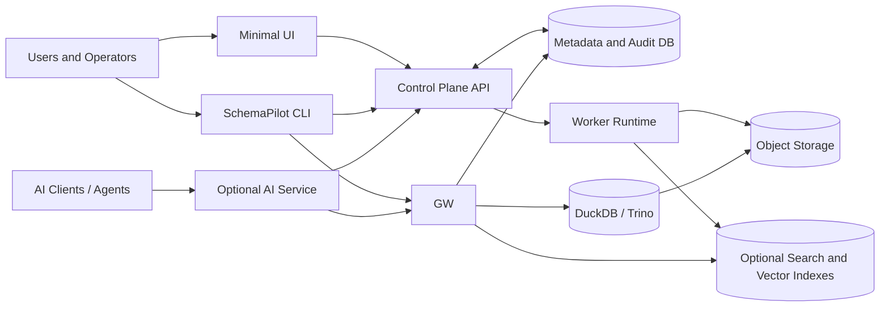
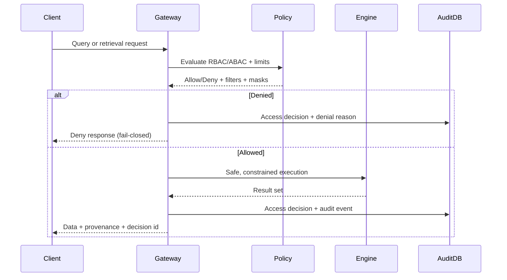

# Architecture

This document explains how SchemaPilot is structured, why that structure scales, and how the platform preserves governance and reliability while still being practical to operate.

## Design Principles

- Single enforcement point for data access: all SQL/retrieval goes through the gateway.
- Fail-closed defaults: uncertain or unsafe states deny, block, or require review.
- Deterministic pipeline behavior: same inputs and config produce the same outputs.
- Evidence-backed governance: risky automation creates review tasks with evidence.
- Operator-first delivery: robust CLI and run diagnostics; intentionally minimal UI.

## System Context

## Layered Architecture

### 1) Experience Layer

- UI: intentionally thin shell for onboarding/review visibility.
- CLI: primary operator interface for onboarding, diagnostics, and governance workflows.
- AI Service (optional): constrained orchestration layer that only talks to gateway and control plane.

### 2) Control Plane

Responsibilities:
- Workspaces, sources, runs, review queue, policy packs, retention/deletion controls.
- Run lifecycle state, run-step DAG visibility, and governance decisions.
- Contract and workflow gates before publish.

### 3) Data Plane

Responsibilities:
- Source discovery and ingest into immutable bronze artifacts.
- Profiling, drift, contracts, semantic assets, and build orchestration.
- Silver/gold generation with deterministic manifests and evidence links.

### 4) Access Plane

Responsibilities:
- RBAC/ABAC decisions, masking, policy simulation, throttling, and provenance.
- Secure SQL execution and optional retrieval adapters.
- Audit and access decision persistence with fail-closed behavior.

## Core Domain Flow: Bronze -> Silver -> Gold

| Layer | Purpose | Invariants |
|---|---|---|
| Bronze | Immutable source-faithful data and manifests | Never overwritten, content-hash anchored |
| Silver | Canonicalized entities and quality controls | Deterministic transforms, quarantine on violations |
| Gold | Governed semantic surface for analytics/AI | Publish gated, rollbackable pointers |

## Query Enforcement Flow

## Worker Orchestration and Run-Step DAG

Run processing is represented as explicit run steps:
- each step has status, timing, error code, and evidence references,
- retries are bounded,
- failures are attributable to a concrete step,
- run diagnostics can be exported as redacted support bundles.

This model is the foundation for `schemapilot analyze` and `schemapilot diag-bundle`.

## Security Architecture

Key controls:
- Non-local bind requires explicit auth mode and valid configuration.
- Gateway-only data access (no direct engine/index bypass in supported deploys).
- Fail-closed audit writes for critical flows.
- Dataset/workspace isolation and policy-bound retrieval.
- Plugin execution constrained by allowlists and sandbox limits.

## Reliability and Determinism

- Strict ingest completeness modes for team/enterprise profiles.
- Gold publish blocked on unresolved governance/quality gates.
- Rollbackable gold pointers and auditable lifecycle transitions.
- Versioned packs, compatibility checks, and migration tooling for controlled evolution.

## Extensibility Model

SchemaPilot grows through controlled extension points:

- Connector plugins
  - conformance-tested,
  - cursor/state aware,
  - sandboxed execution.

- Pack ecosystem (policy/semantic/template)
  - signing and verification,
  - compatibility matrix,
  - migration tooling and CI templates.

- Optional modules
  - AI service,
  - search/vector retrieval,
  - advanced deployment profiles.

All optional modules are explicit opt-in and preserve core gateway governance rules.

## Deployment Views

| Profile | Typical Use | Stack Shape |
|---|---|---|
| Starter | local validation | control-plane + gateway + worker (+ minimal UI) |
| Team | default production OSS path | adds object-store/lakehouse query scale, hardened governance defaults |
| Enterprise | stricter controls and integration | hardened Helm/K8s, stronger policy/ops integration, optional modules |

## Why This Structure Works

- It keeps governance non-optional without slowing practical delivery.
- It supports both local-first adoption and enterprise-hardening paths.
- It gives operators deterministic diagnostics, not guesswork.
- It keeps AI capabilities useful while constrained by explicit policy and provenance.

In short: SchemaPilot is designed to be strict where it must be strict, and flexible where it is safe to be flexible.
