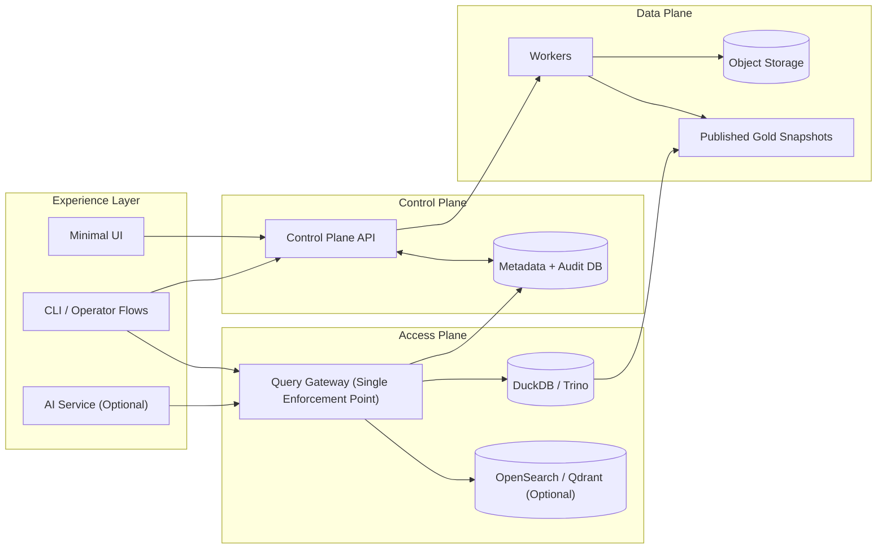

# SchemaPilot

[](https://github.com/aliuyar1234/SchemaPilot/actions/workflows/ci.yml)
[](https://github.com/aliuyar1234/SchemaPilot/actions/workflows/security.yml)
[](https://github.com/aliuyar1234/SchemaPilot/actions/workflows/release.yml)
[](https://github.com/aliuyar1234/SchemaPilot/releases)
[](./LICENSE)
[](https://www.python.org/)

SchemaPilot is a governance-first platform for turning messy company data into an AI-ready, queryable foundation with strong security, deterministic pipelines, and operator-grade controls.

It is built for real environments where data lives in folders, exports, documents, and inconsistent source systems, and where trust, auditability, and safe defaults matter.

## Why SchemaPilot

- Governance first: gateway-enforced RBAC/ABAC, masking, provenance, and fail-closed audit.
- Deterministic data lifecycle: immutable bronze, reproducible silver/gold, controlled publish/rollback.
- Secure-by-default operations: no-bypass deploy checks, strict ingest completeness, staged policy controls.
- Operator-first UX: minimal UI, strong CLI workflows (`doctor`, `analyze`, `diag-bundle`, onboarding, policy simulation).
- Extensible architecture: plugin connectors, pack lifecycle controls, and optional AI/retrieval modules.

## Key Capabilities

- Control Plane for workspaces, sources, runs, review queue, policy packs, retention/deletion workflows.
- Query Gateway as the single data-access enforcement point for SQL and retrieval.
- Worker pipelines for discovery, profiling, contracts, drift, semantic assets, and publish-safe builds.
- AI service (optional) that routes through gateway/control plane only.
- Deployment options from local team setup to hardened Kubernetes/Helm.

## Quick Start

### 1) Install

```bash
python -m pip install -e ".[dev]"
```

### 2) Start local stack

```bash
docker compose -f deploy/docker-compose.yml --profile team up -d control-plane gateway worker ui
```

### 3) Bootstrap demo workflow

```bash
schemapilot onboard-demo --workspace-name "Demo Workspace"
```

### 4) Run a governed query

```bash
schemapilot query --workspace-id <workspace_id> --sql "select 1 as one" --dataset-id dataset-1
```

More onboarding details: `docs/quickstart/FIRST_HOUR.md`.

## High-Level Architecture



For a deeper breakdown, request flows, security boundaries, and deployment views, see `docs/ARCHITECTURE.md`.

## Repository Structure

- `backend/control_plane/` - management APIs, governance workflows, lifecycle controls.
- `backend/gateway/` - policy-enforced SQL/retrieval execution and provenance.
- `backend/workers/` - ingest, profiling, contracts, drift, semantic, and build pipelines.
- `backend/shared_domain/` - shared models, config, security, observability, common services.
- `cli/schemapilot_cli/` - operator and automation commands.
- `deploy/` - Docker, Helm, Kubernetes assets, hardening docs.
- `tools/` - quality gates, release checks, security/perf/chaos/fuzz tooling.
- `docs/` - quickstart, runbook, security model, plugin SDK guidance.

## Implemented Safe Defaults (Current)

- Deny-by-default policies with non-local auth enforcement.
- Gateway-only access model (no direct engine/index bypass in supported deploys).
- Fail-closed audit behavior for critical operations.
- Strict ingest completeness defaults for team/enterprise profiles.
- Retention/deletion controls with separation of duties and legal-hold logic.
- Plugin allowlists and sandbox controls for connector execution.

## CLI Workflows

- Preflight: `schemapilot doctor`
- Interactive onboarding: `schemapilot init-interactive`
- Run health analytics: `schemapilot analyze --workspace-id <id>`
- Support package: `schemapilot diag-bundle --workspace-id <id>`
- Policy dry-run: `schemapilot policy-simulate ...`
- Policy audit report: `schemapilot policy-audit-report ...`

## Quality, Testing, and Release Discipline

- Unit/integration/e2e suites and security negative-path coverage.
- Boundary checks, OpenAPI compatibility, manifest verification, no-bypass checks.
- Security fuzz and chaos drills in release gating.
- Supply-chain outputs for releases (SBOM, provenance, artifact signing utilities).

Run full validation:

```bash
python -m pytest -q
python tools/check_boundary_fitness.py
python tools/release_gate.py
```

## Where to find X

- Detailed architecture: `docs/ARCHITECTURE.md`
- Operator runbook index: `docs/runbook/README.md`
- Quickstart: `docs/quickstart/FIRST_HOUR.md`
- Security model: `docs/security/SECURITY_MODEL.md`
- Plugin SDK: `docs/PLUGIN_SDK.md`
- Deployment guide: `deploy/README.md`

## Contributing

Contributions are welcome. Start with:

- `CONTRIBUTING.md`
- open issues/discussions for feature proposals and bug reports

## License

Apache-2.0. See `LICENSE`.

