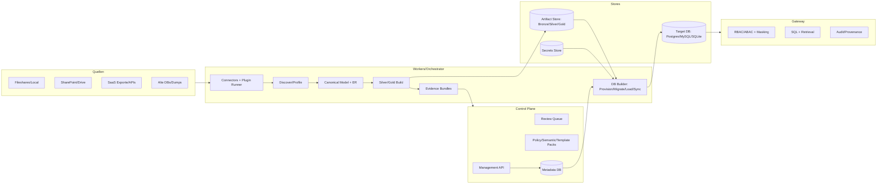
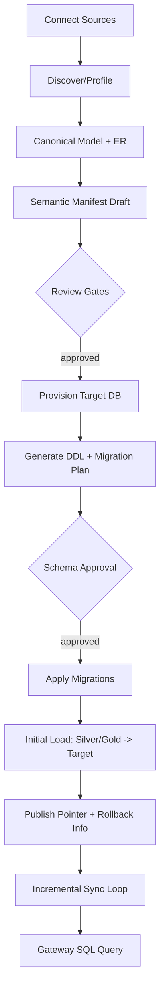

# SchemaPilot Database Builder Plan (GPT Pro Snapshot)

_Source: user-provided GPT Pro architecture/task response.  
Purpose: single in-repo reference for implementation planning._

## 1) Executive Summary

- SchemaPilot has a strong governance-first backbone already (fail-closed auth/audit, gateway single-enforcement, deterministic pipelines).
- Biggest next value lever is a **Database Builder** for non-technical companies.
- v1 target: one active serving DB per workspace (`sqlite | postgres | mysql`), queried only via gateway.
- Canonical truth remains artifacts + semantic manifest; target DB is materialized/rebuildable.
- Schema changes must be plan/evidence/review/approval/apply (no silent evolution).
- Managed Postgres should be default (Team/Enterprise), SQLite for starter/eval, MySQL mainly external target in v1.
- Strict no-bypass deployment and least-privilege DB roles are non-negotiable.
- Sync must be deterministic with strict completeness defaults (no silent partial sync).
- CLI-first operator flow is preferred; UI stays minimal.
- v1 success metric: first secure answer in <60 minutes with full provenance/audit.

## 2) Problem-Solution Fit

Pain points addressed:
- Data chaos across SharePoint/files/SaaS/exports.
- No in-house DB/data engineering capability.
- AI quality blocked by poor data foundations.

First-hour outcome:
- connect source -> discover/profile -> approvals -> provision target DB -> initial load -> governed query via gateway.

## 3) v1 Product Definition (Database Builder)

v1 includes:
- Target DB profile/state management per workspace.
- Provisioning (managed Postgres + external Postgres/MySQL + SQLite target path).
- Deterministic DDL generation from semantic/canonical model.
- Approval-gated migration planning/execution.
- Initial load + incremental sync with strict completeness.
- Gateway read-only target DB execution with policy safety and provenance.

v1 excludes:
- Ungated automatic destructive schema changes.
- Mandatory CDC for all sources.
- UI-heavy admin workflows.
- Aggressive auto-tuning/index automation without evidence/approval.

## 4) Architecture Options

### Option A (Recommended): Artifacts Canonical, Target DB as Serving Layer
- Keep artifacts + semantic manifest as source of truth.
- Materialize into target DB for serving/query.
- Best for determinism, rollback, portability, and low lock-in.

### Option B: Target DB Canonical
- Simpler runtime surface but higher lock-in and harder deterministic rebuild/switch.

### Option C: Lakehouse-first + relational cache
- Scales well but higher ops complexity; better as Enterprise upgrade path.

## 5) Mermaid Diagrams

### High-Level

### Flow: Source -> Model -> Target DB -> Gateway

## 6) Prioritized Task IDs

### P0 (v1 critical)

- `DB-0001` Target DB adapter interface + registry
- `DB-0002` Target DB profile/state models + CP APIs + CLI wiring
- `DB-0003` Managed Postgres provisioner (compose/helm), roles, internal-only
- `DB-0004` External DB validator (Postgres/MySQL) with least-privilege checks
- `DB-0005` Deterministic DDL generator + type mapping
- `DB-0006` Migration planner (diff + destructive detection) + evidence + review tasks
- `DB-0007` Migration executor (transactional apply) + migration table
- `DB-0008` Target DB publish/rollback integration
- `DB-0009` Initial load staging + swap (idempotent)
- `DB-0010` Incremental sync engine + strict completeness
- `DB-0011` Gateway Postgres executor (read-only + safety + provenance)
- `DB-0012` No-bypass deploy/static/doctor updates
- `DB-0013` E2E harness for source->target->gateway->rollback + determinism
- `DB-0014` Backup/restore drill extended for target DB
- `DB-0015` DB Builder docs/runbook/quickstart

### P1

- `DB-0016` SQLite target full support
- `DB-0017` MySQL external target support
- `DB-0018` Conservative index/constraint strategy (approval-gated)
- `DB-0019` Sync scheduling profiles + dataset budgets/quotas
- `DB-0020` Operator UX (`target-db plan/apply/status`) + review TUI improvements

### P2

- `DB-0021` Multi-target support (shadow + cutover)
- `DB-0022` Optional Postgres RLS pushdown (defense in depth)
- `DB-0023` Optional CDC connectors
- `DB-0024` Policy-aware result cache tuning for target DB
- `DB-0025` AI schema evolution advisor (proposal-only, no auto-apply)

## 7) PR Sequence (Execution Order)

- `PR-001` DB-0001
- `PR-002` DB-0002 (models/migrations)
- `PR-003` DB-0002 (CP APIs/OpenAPI)
- `PR-004` DB-0002 (CLI)
- `PR-005` Worker DB builder skeleton (plan-only)
- `PR-006` Managed Postgres deploy profile + no-bypass checks
- `PR-007` Managed Postgres provisioner + secrets
- `PR-008` External Postgres validator
- `PR-009` Deterministic DDL + type mapping
- `PR-010` Migration planner + destructive gating
- `PR-011` Migration executor
- `PR-012` Publish/rollback integration
- `PR-013` Initial load staging/swap
- `PR-014` Incremental sync engine
- `PR-015` CP sync state endpoints
- `PR-016` Gateway target DB executor
- `PR-017` Deploy hardening + doctor exposure checks
- `PR-018` E2E + determinism harness updates
- `PR-019` Backup/restore drill extension
- `PR-020` Docs/runbook/quickstart
- `PR-021` SQLite target support
- `PR-022` MySQL external support
- `PR-023` Index/constraint planner (approval gated)
- `PR-024` Operator UX improvements

## 8) Definition of Done (v1)

- End-to-end path works: discover -> approvals -> provision -> migrate -> load -> gateway query -> rollback.
- Deterministic rebuild checks pass.
- No-bypass deploy checks pass (DB ports internal-only by default).
- Fail-closed audit/policy behavior preserved.
- Provenance includes target DB build/schema/migration identifiers.
- Backup/restore drill covers managed target DB.
- Quickstart/runbook updated and reproducible.

## 9) Implementation Status (Current Repo)

P0:

- [x] `DB-0001` Target DB adapter interface + registry
- [x] `DB-0002` Target DB profile/state + Control Plane API + CLI wiring
- [x] `DB-0003` Managed Postgres provisioning plan + secret refs + deploy profile hardening
- [x] `DB-0004` External target validation with least-privilege/drift checks
- [x] `DB-0005` Deterministic DDL generator + type mapping
- [x] `DB-0006` Migration planner + destructive gating + review task creation
- [x] `DB-0007` Migration apply path + plan checksum enforcement + audit/evidence linkage
- [x] `DB-0008` Target DB publish/rollback state integration
- [x] `DB-0009` Initial load plan/apply path with deterministic checksums
- [x] `DB-0010` Incremental sync strict mode + cursor/state semantics
- [x] `DB-0011` Gateway target-db execution (`sqlite` + `postgres` DSN path) with read-only safety
- [x] `DB-0012` No-bypass deploy/static/doctor checks
- [x] `DB-0013` E2E golden path includes target-db publish/query/rollback validation
- [x] `DB-0014` Backup/restore drill validates restored target-db query path
- [x] `DB-0015` Database Builder quickstart/runbook documentation

P1:

- [x] `DB-0016` SQLite target build-file materialization + publish/rollback pointer switching
- [x] `DB-0017` MySQL external target query adapter (gateway, read-only)
- [x] `DB-0018` Conservative index/constraint planner with approval-gated apply flow
- [x] `DB-0019` Sync schedules + per-run budget controls (`max_runtime_seconds`, dataset/row quotas)
- [x] `DB-0020` Operator UX for `target-db plan/apply/status`, cutover and schedule commands

P2:

- [x] `DB-0021` Multi-target cutover endpoint (shadow -> active switch, audit tracked)
- [x] `DB-0022` Optional Postgres RLS plan/apply flow behind `SCHEMAPILOT_TARGET_DB_RLS_ENABLED`
- [x] `DB-0023` Optional CDC connector examples (`postgres_cdc`, `mysql_cdc`) + conformance fixtures
- [x] `DB-0024` Policy-aware target-db query cache scoping (`target_db_id`, build/schema refs)
- [x] `DB-0025` AI schema evolution advisor endpoint (proposal-only, no auto-apply)

## 10) Open Questions

Blocking:
- Whether managed target DB provisioning is allowed in v1 for all deployment profiles.

Non-blocking conservative defaults:
- Managed MySQL not required in v1 (external-first).
- RLS pushdown optional (gateway remains enforcement source).
- Full reload fallback for non-cursor sources in strict mode.
